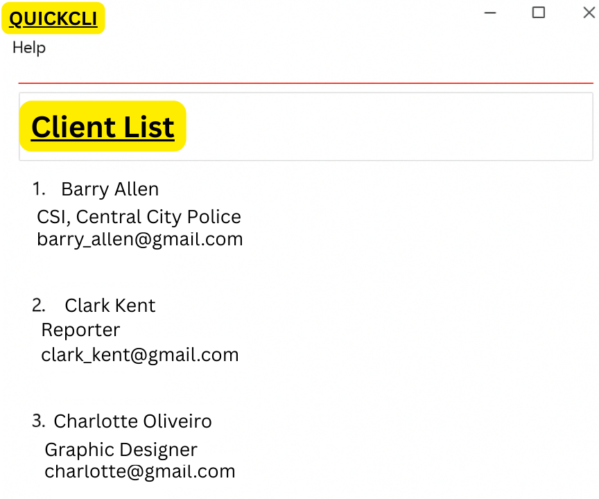

# QuickCLI

QuickCLI is a **desktop app for freelance professionals to manage client contacts efficiently**, optimized for use via a Command Line Interface (CLI).

* Target user: Freelance professionals and consultants
* Value proposition: Eliminates time-consuming contact searches by providing instant CLI-based access

## UI Mockup

## Acknowledgements
This project is based on the AddressBook-Level3 project created by the [SE-EDU initiative](https://se-education.org).